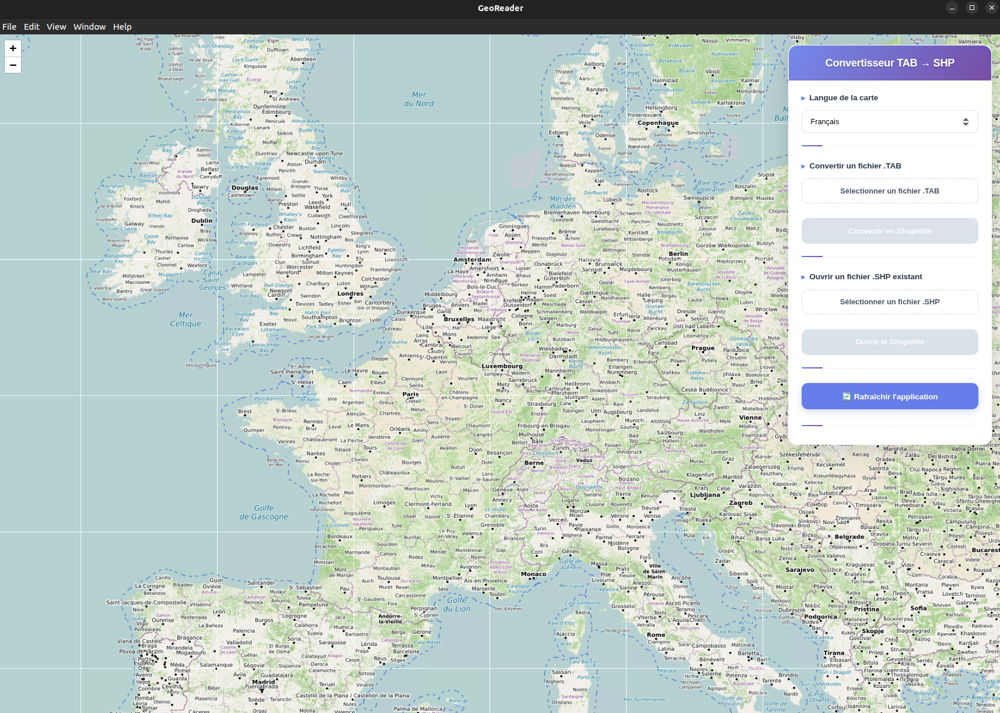

# GeoReader

GeoReader is an open-source tool built on top of **GDAL** (specifically `ogr2ogr` ) that allows you to **convert MapInfo** `.TAB` files into ESRI Shapefiles (`.shp`) and visualize the data directly on a map powered by **[Leaflet](https://leafletjs.com/)**.



## 🚀 Description

The main goal of GeoReader is to streamline the process of working with MapInfo `.TAB` files by converting them into a widely supported format (Shapefile) and providing quick visualization.

### How it works:

1. **Conversion and display**

    - The user selects a `.TAB` file.

    - GeoReader converts it into a Shapefile and creates a folder named `XXX_shp`.

    - Inside this folder, you will find `XXX.shp`, which can be loaded and displayed on the Leaflet map.

2. **Direct display**

    - If you already have a Shapefile, you can skip conversion and directly display it on the map.

### Why Shapefile instead of GeoJSON?

Although **GeoJSON** is simpler and widely used in web applications, Shapefiles still provide several advantages:

- **Performance**: Shapefiles are more efficient for handling large geospatial datasets.

- **Compatibility**: Supported by almost all GIS software and enterprise systems.

- **Multiple files support**: Shapefile datasets are split across files (`.shp`, `.shx`, `.dbf`, etc.), making them scalable for heavy GIS operations.

- **Projection handling**: Better support for different coordinate systems and large-scale transformations.

## 📦 Prerequisites

Before installing GeoReader, make sure you have the following tools installed:

- [Git](https://git-scm.com/book/fr/v2/D%C3%A9marrage-rapide-Installation-de-Git)

- [GDAL](https://gdal.org/en/stable/download.html#download), version: 3.4.1

- [Node.js](https://nodejs.org/en/download), version: v20.19.4

## Install prerequisites on macOS with Homebrew

If you don’t already have Homebrew installed, run the following command in your terminal:
```bash
/bin/bash -c "$(curl -fsSL https://raw.githubusercontent.com/Homebrew/install/HEAD/install.sh)"
```

Update Homebrew:
```bash
brew update
```

Then install the required tools:
- **Git**:
```
brew install git
```
- **GDAL**:
```bash
brew install gdal --complete
```
- **Node.js**:

    1. Install `nvm` by Homebrew:
    ```bash
    brew install nvm
    ```
    2. Create `nvm` folder if it doesn't exist:
    ```bash
    mkdir ~/.nvm
    ```
    3. Add this lignes to your `~/.zshrc` or `~/.bashrc` file:
    ```bash
    export NVM_DIR="$HOME/.nvm"
    source "$(brew --prefix nvm)/nvm.sh"
    ```
    4. Load your shell:
    ```bash
    source ~/.zshrc
    ```
    5. Install your specific node version:
    ```bash
    nvm install 20.19.4
    ```
    6. Use this version by default:
    ```bash
    nvm alias default 20.19.4
    nvm use 20.19.4
    ```

See version:
```bash
git --version # -> git version 2.34.1
ogr2ogr --version # -> GDAL 3.4.1, released 2021/12/27
node --version # -> v20.19.4
npm --version # -> 10.8.2
```

## ⚙️ Installation

1. Open a terminal.

2. Clone the project:
    ```bash
    git clone https://github.com/your-username/GeoReader.git
    ```

3. Navigate into the project directory:
    ```bash
    cd GeoReader
    ```

4. Install dependencies (the project is built with Vue.js):
    ```bash
    npm install
    ```

## ▶️ Running GeoReader

At the root of the project:

- For the first time, run

    ```bash
    chmod +x georeader.sh
    ./georeader.sh
    ```

- For other times you can simply run

    ```bash
    ./georeader.sh
    ```

This will start the Vue.js application, served via Electron, and launch the interface where you can convert and visualize your data.

## ❌ Quitting GeoReader
To stop the application, simply go back to the terminal window where GeoReader is running and press:

```bash
Ctrl + C
```
Or just close app's window.

## 🔧 Example: Conversion Command in Backend

The core of GeoReader’s backend uses the GDAL ogr2ogr command.

Example:
```bash
ogr2ogr -f "ESRI Shapefile" -t_srs EPSG:4326 myfile_shp my_file.TAB
```

**Explanation**:

- `ogr2ogr` → GDAL’s tool for converting and transforming geospatial data.

- `-f "ESRI Shapefile"` → Defines the output format (here: Shapefile).

- `-t_srs EPSG:4326` → Reprojects the data into WGS84 (EPSG:4326), which is widely supported by web mapping libraries like Leaflet.

- `myfile_shp` → The output directory where the new Shapefile will be created.

- `my_file.TAB` → The input MapInfo TAB file to be converted.